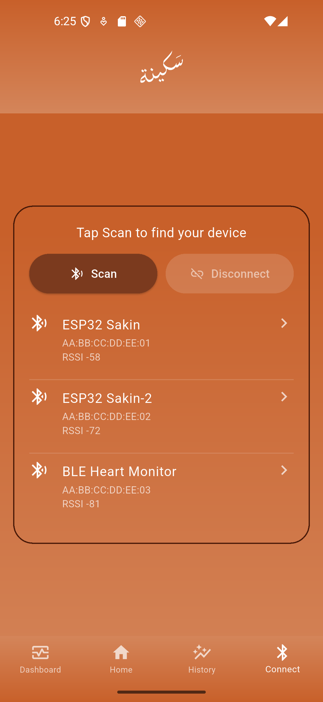
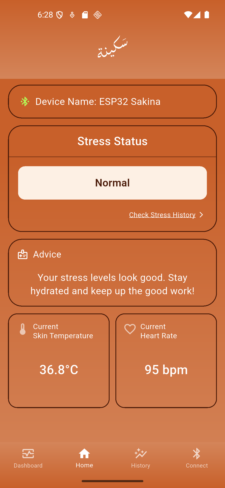
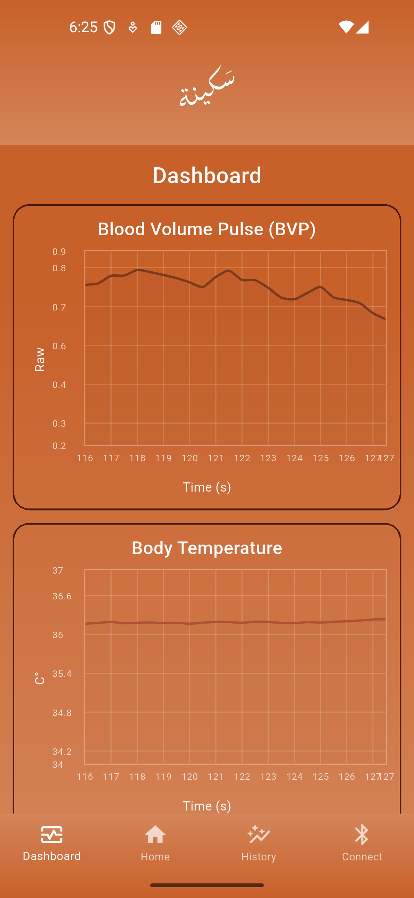
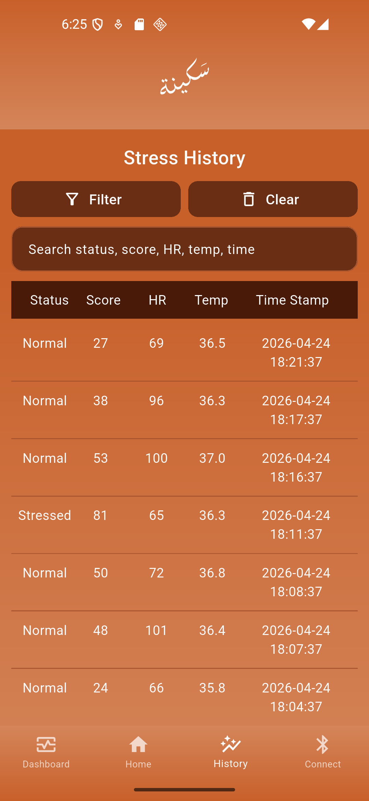
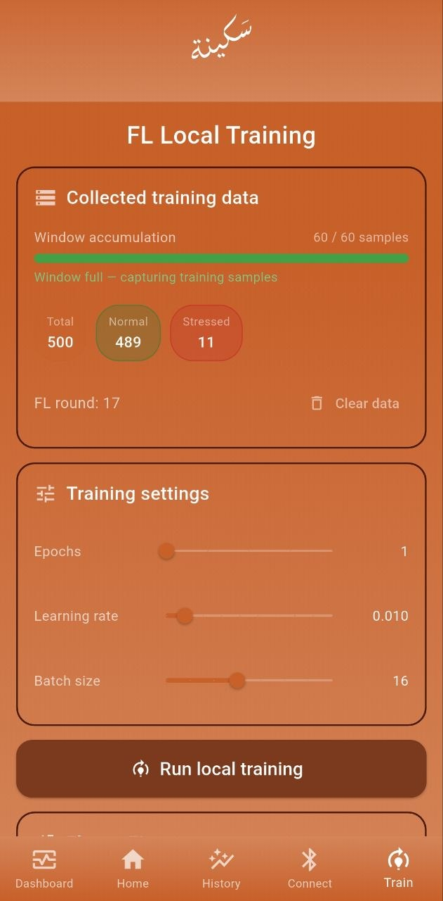
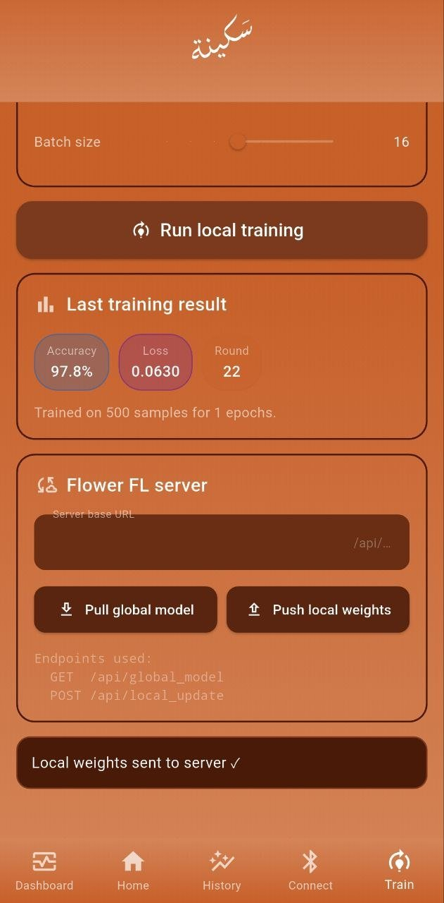

# سَكينة | Sakina
### Stress Monitoring using Federated Learning

Sakina is a privacy-preserving, real-time stress monitoring system built as a capstone project (CPCS499). It combines edge AI inference on an ESP32 microcontroller with a Flutter mobile application and a Federated Learning pipeline, all without sharing raw physiological data with any server.

> **Group C02** | Tariq Areesh | Majd Al-farasani
> King Abdulaziz University | Computer Science

---

## What Is This Repo?

This repository contains the **Flutter mobile application** for the Sakina project. The FL server, simulation clients, and training scripts live in a separate repository.

---

## How It Works

1. The **ESP32** simulates BVP and temperature sensor data, runs a quantized TFLite MLP model locally, and sends the stress prediction to the phone over **Bluetooth Low Energy (BLE)**
2. The **Flutter app** connects to the ESP32 via BLE, shows real-time health data, and quietly collects training samples in the background
3. The app fine-tunes the model locally on the user's own data using **on-device FL training** | no raw data ever leaves the phone
4. The locally trained weights are pushed to a central **Flower FL server** via a simple REST API, and the updated global model can be pulled back to the app at any time

---

## App Screenshots

### Connect Page
Scan for nearby BLE devices, pick the ESP32, and connect.

<p align="center">

</p>

---

### Home Page
Shows the connected device name, current stress status, health advice, skin temperature, and heart rate in real time.

<p align="center">

</p>

---

### Health Dashboard
Live scrolling charts for Blood Volume Pulse (BVP) and Body Temperature that update as data streams in over BLE.

<p align="center">

</p>

---

### Stress History
A searchable and filterable log of all past stress readings with timestamps, score, HR, and temperature.

<p align="center">

</p>

---

### FL Local Training, Data and Settings
Shows collected BLE training samples broken down by Normal and Stressed labels, window accumulation progress, and training settings like epochs, learning rate, and batch size.

<p align="center">

</p>

---

### FL Local Training, Results and Server
Displays the last training result (accuracy, loss, FL round) and lets you push local weights to the Flower FL server or pull the latest global model.

<p align="center">

</p>

---

## System Architecture

| Component | Technology |
|-----------|-----------|
| Edge Device | ESP32 + TensorFlow Lite Micro (INT8) |
| Mobile App | Flutter (Dart) |
| BLE Communication | flutter_blue_plus |
| On-Device Training | Pure Dart MLP (5 to 64 to 32 to 1) |
| FL Server Communication | HTTP REST API (Flask) |
| FL Strategy | FedAdam |
| Model Accuracy | ~96% on expanded WESAD dataset |

---

## Project Structure

```
lib/
├── main.dart                  # App entry point
├── appShell.dart              # Bottom nav + BLE state management
├── homePage.dart              # Home screen
├── healthDashboardPage.dart   # Live BVP and temp charts
├── stressHistoryPage.dart     # History log with search and filter
├── blu.dart                   # BLE scan, connect, receive logic
├── fl_local_trainer.dart      # On-device FL training (Dart MLP)
└── fl_training_page.dart      # FL training UI

assets/
└── sakina_initial_weights.json   # Pre-trained Keras weights (float32)
```

---

## How to Run

### Prerequisites

- Flutter SDK (3.x)
- Android device with Bluetooth (API 23+) and developer mode enabled
- An ESP32 flashed with the Sakina firmware
- The Flower FL server running (see the server repo) if you want to use the FL features

---

### 1. Clone and Run

```bash
git clone https://github.com/Sakina-G02/Sakina-App.git
cd Sakina-App
flutter pub get
flutter run
```

Make sure `assets/sakina_initial_weights.json` is present and listed in `pubspec.yaml`:

```yaml
flutter:
  assets:
    - assets/sakina_initial_weights.json
```

---

### 2. Connect to the FL Server

The app communicates with the Flower FL server through two REST endpoints:

| Endpoint | Method | Description |
|----------|--------|-------------|
| `/api/global_model` | GET | Download the latest aggregated global model weights |
| `/api/local_update` | POST | Upload locally trained weights to the server |

To connect:

1. Start the FL server on your PC (see the server repo)
2. Make sure your phone and PC are on the same WiFi network
3. In the app, go to the **Train** tab
4. Enter your PC's local IP as the server URL: `http://<your-ip>:5050`
5. Tap **Pull global model** to load the latest weights
6. After local training completes, tap **Push local weights** to contribute to the global model

---

## Privacy Design

- Raw physiological data never leaves the device
- Only model weight updates are shared with the server, not the sensor readings themselves
- The FL server aggregates updates without seeing any user data
- Inference runs entirely on the ESP32, so there is no cloud dependency for stress predictions